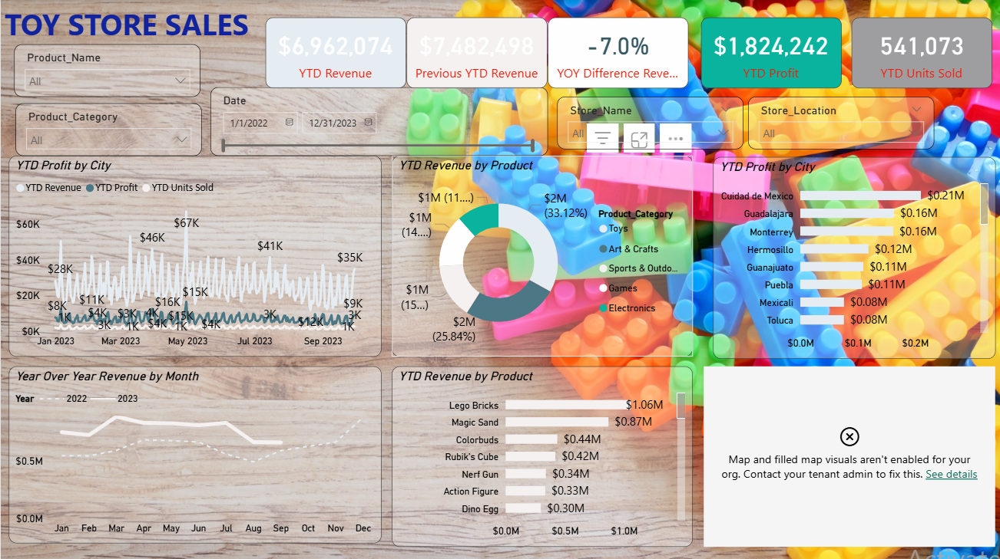
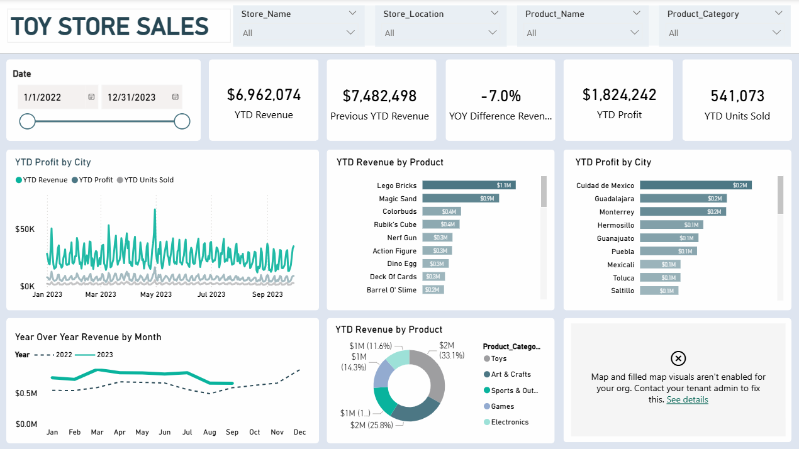

# Toy Store Sales Dashboard Redesign

This project focuses on improving dashboard design and data communication using the same dataset.

Instead of modifying the data, the goal was to redesign the dashboard to make it cleaner, more structured, and easier for users to understand key insights at a glance.

---

## 🎯 Objective

- Improve dashboard clarity and readability  
- Enhance visual hierarchy  
- Apply a consistent color theme  
- Reduce clutter and highlight key insights  

---

## 🛠 Tools & Skills

- Power BI  
- Color Extractor Website  
- Dashboard Design  
- Color Theory & Layout Optimization  

## 🔄 Process

1. Developed a clear understanding of the dataset and business metrics  
2. Reviewed existing dashboards for inspiration  
3. Extracted color palettes and created a custom theme  
4. Redesigned layout for better spacing and alignment  
5. Simplified visuals to improve user experience  

## 📈 Key Improvements

- Cleaner and more professional layout  
- Better KPI visibility (Revenue, Profit, Units Sold)  
- Improved contrast and readability  
- Structured and intuitive visual flow  
- Consistent design across all visuals  

---

## 🖼 Before vs After

### Before

### After

## 💡 Key Learning

A good dashboard is not about adding more visuals — it’s about removing noise and guiding the audience to the right insights.
---

## 📌 Author

**Min Htet Myet**  

## ⭐ If you like this project

Feel free to star ⭐ the repository or connect with me on LinkedIn!
